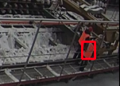

# ICVR Task solution

# Installation & Usage
1. Download and install darknet framework, like [this one](https://github.com/AlexeyAB/darknet)
2. Set up `config.ini`:
```
[Darknet]
path=/home/kirill/projects/... <-- specify the absolute path of the darknet framework

[Label]
class_0 = Jacket               <-- set names of classes
class_1 = Helmet               -//-
class_2 = Person               -//-

[Model]
config_name=yolov4.cfg         <-- specify name of cfg file of yolo model in 
                                   'inference_model_data'
weights_name=yolov4.weights    <-- specify name of file with yolo model weights in 
                                   'inference_model_data'
```
3. For getting predicts, run the command `python detect.py {image_path}`, for example `python detect.py /home/kirill/data/ICVR_dataset/dataset/2_0000004.jpg`

# Solution explanation
## 1. EDA
Below you can see Q&A about data in this task, EDA available by this [link](https://nbviewer.org/github/kiru883/ICVR/blob/main/notebooks/EDA.ipynb). Below image i write conclusion and tell about bad annotated data.

__Conclusion__. This is task of workers/his equipment detection (maybe with goal of compliance of labor protection). There are 3 classes: vest(class 0), 
helmet(class 1), person(class 2). Dataset has 3222 annotated images in jpg format of same size - 1080x1920. Markup is in the yolo format 
(class_type bbox_center_x bbox_center_y bbox_center_width bbox_center_height). 157 images don't contain any person or classes. For each image exists pair "image-annotation".
    
There are some __badly annotated images__ (not fully labeled objects) in the dataset, `9_0000008, 9_0000011, 9_0000013, 9_0000017, 9_0000014, 9_0000012, 9_0000016`. Examples of markup for that images:
    


## 2. Data preparation and training
### Data preparation
I split dataset on 3 sets: train/test/val in proportions 0.7/0.15/0.15 accordingly. Futhermore, BAD_IMAGES has been deleted from dataset. Dataset was split on
train/test/val stratify(with objects / without objects).

### Training
Code for data preparation/training located jupyter notebook in /experiments/vA (for all experiments vA, vB and etc.) [link](https://nbviewer.org/github/kiru883/ICVR/blob/main/experiments/vA/train_vA_vB_vC.ipynb).
In my experiments I train yolov4 and tiny yolov4. Below, the table contains metrics, parameters and comments for each experiment.

| Experiment |                                           Parameters                                          | Metrics mAP@0.5 (mean by 3 classes) |                       Comments                       |
|:----------:|:---------------------------------------------------------------------------------------------:|:-----------------------------------:|:----------------------------------------------------:|
| v0         | Model: Yolo v4, batch size - 64(minibatch size 4)                                             | -                                   | Needs many training time (18h), decided not to train |
| vA         | Model: Yolo v4 tiny, all parameters the same as in orig. cfg. file                            |       88.12(val) / 84.66(test)      |                                                      |
| vB         | Same model as in vA, change LR=0.0015, and image size (512x320), number of iterations,  20000 |       82.62(val) / 80.27(test)      |                                                      |
| vC         | All the same as in vA, changed batch_size(96), lr(0.0024), number of iterations (10000)       |       85.44(val) / 84.23(test)      |                                                      |            

## 3. Visualize predictions results
For predicts visualization I use better model(v) and images from test set 

1. 1345.jpg
   
2. 000013.jpg
   
3. 11_0000004.jpg
   
